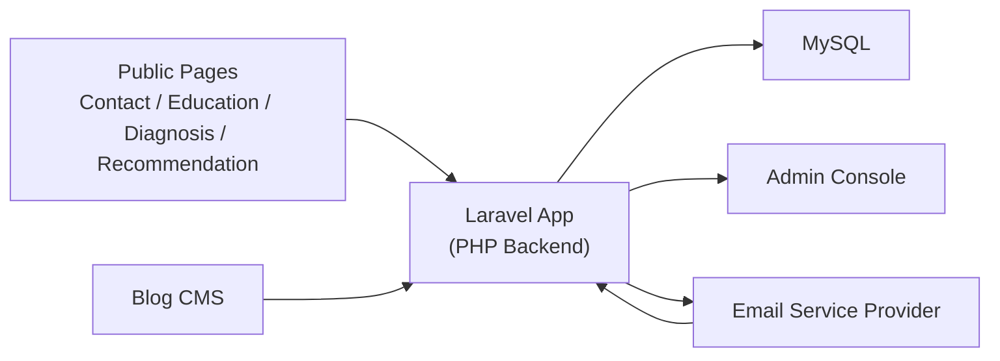

# System Architecture

## 1. MVP 아키텍처 원칙

현재 프로젝트 규모에서는 `하나의 PHP 백엔드`, `하나의 MySQL DB`, `하나의 관리자 화면`, `하나의 메일링 서비스`로 충분하다.

핵심은 시스템을 크게 나누는 것이 아니라, 데이터를 끊기지 않게 연결하는 것이다.

## 2. 권장 아키텍처

백엔드는 하나지만, 내부적으로는 아래 운영 모듈을 가진다.

- Lead Intake
- Diagnosis / Recommendation
- Education Operations
- Project Delivery Tracking
- Case Library
- Blog Mailing
- Performance Dashboard

## 3. 컴포넌트 설명

### Public Pages

- 교육 문의 페이지
- 일반 문의 페이지
- AX 진단 페이지
- AX 맞춤 추천 페이지
- 블로그 글 상세 페이지

모든 폼은 직접 외부 도구로 보내지 않고 `Laravel App`을 통해 저장한다.

### Laravel App

역할은 아래에 집중한다.

- 폼 입력 검증
- 고객 중복 확인
- 고객/이력 저장
- 진단/추천 결과 저장
- 관리자용 조회 API
- 메일 발송 요청
- 메일 이벤트 webhook 수신

### Relational DB

MVP에서는 MySQL이면 충분하다.

DB에는 아래 정보가 들어간다.

- 고객
- 문의/활동 이력
- 진단 결과
- 추천 결과
- 교육 프로그램, 회차, 참여자, 결과물
- 컨설팅/솔루션 프로젝트 기록
- 사례/성과
- 블로그 발행 정보
- 메일 발송 및 반응 이력

### Admin Console

운영자가 사용하는 내부 화면이다.

- 신규 문의 인박스
- 고객 상세
- 교육 운영 보드
- 프로젝트 운영 보드
- 사례 검색
- 블로그 메일 발송
- 성과 대시보드

### Email Service Provider

실제 발송은 외부 서비스에 맡긴다.

후보:

- Brevo
- Mailchimp
- SendGrid

선정 기준:

- API 단순성
- webhook 지원
- 구독 해지 처리
- 비용

## 4. 핵심 데이터 흐름

### 문의/진단 입력

1. 사용자가 폼 제출
2. 백엔드가 이메일 기준으로 기존 고객 확인
3. 신규면 고객 생성, 기존이면 이력만 추가
4. 폼 타입에 따라 문의/진단/추천 결과 저장
5. 관리자 인박스에 신규 항목 노출

### 블로그 메일링

1. 운영자가 블로그 글 등록 또는 발행 상태 갱신
2. 발송 대상 조건 선택
3. 백엔드가 고객 목록 조회
4. 동의 여부와 태그 기준으로 발송 대상 생성
5. 이메일 서비스로 발송
6. 오픈/클릭/수신거부 webhook 수신 후 DB 반영

### 교육 운영 및 결과물

1. 교육 프로그램 생성
2. 회차와 일정 등록
3. 참여 회사/참여자 연결
4. 진단 리포트와 실습 산출물 저장
5. 후속 액션과 상담/제안 연결
6. 우수 결과물은 사례 후보로 승격

### 프로젝트 실행 및 종료

1. 상담 또는 교육 이후 프로젝트 생성
2. 프로젝트 유형과 상태 저장
3. 진행 메모와 산출물 누적
4. 종료 요약과 성과 기록
5. 필요 시 사례 후보로 승격

## 5. 선정 기술 스택

현재 개발 플랫폼은 아래 조합으로 고정한다.

### 백엔드

- `PHP`
- `Laravel`

### 관리자 화면

- `Blade`
- `Livewire` 또는 단순 서버 렌더링 기반 화면

### DB

- `MySQL`

### 배치 및 비동기 처리

- `Laravel Scheduler`
- `cron`
- 필요 범위에서 `Laravel Queue`를 최소 도입

### 인프라

- `Nginx`
- `PHP-FPM`
- 단일 서버 또는 작은 클라우드 인스턴스

상세 설계는 [08-php-mysql-detailed-architecture.md](/Users/magic/work/MAX-Engage-Hub/docs/08-php-mysql-detailed-architecture.md) 문서를 따른다.

## 6. 지금은 넣지 않는 것

- 마이크로서비스
- 별도 메시지 브로커
- 복잡한 비동기 워크플로 엔진
- 별도 CDP
- 실시간 세그먼트 엔진

MVP의 목표는 확장성 과시가 아니라 운영 가능성 검증이다.
