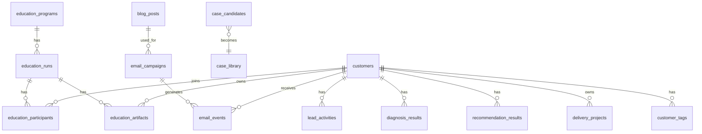

# Data Model And Workflows

## 1. 핵심 엔티티

### customers

고객 기본 정보

- id
- name
- email
- phone
- company_name
- job_title
- consent_marketing
- latest_source
- status
- created_at
- updated_at

### lead_activities

고객의 모든 접점 이력

- id
- customer_id
- activity_type
- source
- title
- payload_json
- created_at

예시 activity_type:

- `contact_submitted`
- `education_inquiry_submitted`
- `diagnosis_completed`
- `recommendation_requested`
- `email_opened`
- `email_clicked`

### diagnosis_results

- id
- customer_id
- overall_score
- maturity_level
- main_pain_points
- summary
- created_at

### recommendation_results

- id
- customer_id
- recommendation_type
- recommendation_reason
- next_action
- created_at

### education_programs

- id
- title
- type
- description
- target_audience
- created_at

### education_runs

- id
- education_program_id
- company_name
- start_date
- end_date
- status
- owner
- created_at

예시 status:

- `planned`
- `active`
- `completed`
- `follow_up`

### education_participants

- id
- education_run_id
- customer_id
- role
- attendance_status
- created_at

### education_artifacts

- id
- education_run_id
- customer_id
- artifact_type
- title
- summary
- file_url
- created_at

예시 artifact_type:

- `diagnosis_report`
- `exercise_output`
- `action_plan`
- `mentoring_note`
- `team_assignment`

### delivery_projects

컨설팅 또는 솔루션 구축 프로젝트 관리 단위

- id
- customer_id
- company_name
- project_type
- title
- status
- owner
- start_date
- end_date
- summary
- created_at

예시 project_type:

- `consulting`
- `solution_build`
- `maintenance`

### customer_tags

- id
- customer_id
- tag
- created_at

예시 태그:

- `education_interest`
- `paid_diagnosis_candidate`
- `rag_interest`
- `ocr_interest`
- `automation_interest`
- `high_intent`

### case_library

상담과 제안에서 재사용할 사례 저장소

- id
- title
- industry
- department
- problem
- solution_type
- summary
- outcome
- metrics_json
- status
- created_at

### case_candidates

교육 결과물 또는 프로젝트 결과를 사례로 전환하기 전 단계 저장소

- id
- source_type
- source_id
- company_name
- title
- summary
- outcome
- review_status
- created_at

예시 source_type:

- `education_artifact`
- `diagnosis_result`
- `project_delivery`

### blog_posts

- id
- title
- slug
- category
- summary
- published_at

### email_campaigns

- id
- blog_post_id
- name
- audience_rule
- sent_at
- total_sent

### email_events

- id
- campaign_id
- customer_id
- event_type
- occurred_at

예시 event_type:

- `sent`
- `opened`
- `clicked`
- `bounced`
- `unsubscribed`

## 2. 최소 관계 구조

## 3. 업무 흐름

### A. 리드 유입 및 분류 워크플로우

1. 고객이 문의 또는 진단 폼 제출
2. 이메일 기준으로 고객 조회
3. 없으면 새 고객 생성
4. 활동 이력 저장
5. 필요 시 태그 부여
6. 관리자 인박스에 신규 표시

### B. AX 진단 및 첫 상담 워크플로우

1. 진단 응답 저장
2. 점수 계산 또는 구간 분류
3. 기본 추천 생성
4. 고객 상세 화면에 결과 노출
5. 관련 사례를 연결해 상담 준비

### C. 교육 운영 워크플로우

1. 교육 프로그램 등록
2. 교육 회차 생성
3. 참여 회사와 참여자 연결
4. 교육 중 결과물과 메모 저장
5. 교육 종료 후 후속 액션 저장
6. 필요 시 추가 상담 또는 솔루션 제안으로 연결

### D. 교육 결과물 기반 사례화 워크플로우

1. 교육 결과물 검토
2. 사례 후보 등록
3. 공개 가능 범위 검토
4. 사례 라이브러리 승인 등록
5. 이후 상담과 제안에서 재사용

### E. 컨설팅/솔루션 프로젝트 실행 워크플로우

1. 상담 결과를 바탕으로 프로젝트 생성
2. 프로젝트 유형과 범위 설정
3. 진행 메모와 중간 산출물 저장
4. 프로젝트 종료 시 성과와 결과 요약 저장
5. 사례 후보 전환 여부 판단

### F. 사례 활용 워크플로우

1. 담당자가 고객의 산업/부서/문제 확인
2. 사례 라이브러리에서 유사 사례 검색
3. 상담 또는 제안에 사례 활용
4. 이후 실제 성과를 다시 사례 라이브러리에 축적

### G. 블로그 메일링 워크플로우

1. 블로그 글 발행
2. 운영자가 수신 대상 선택
3. 메일 발송
4. 메일 이벤트 저장
5. 반응 고객에 태그 또는 상태 업데이트

### H. 성과 리뷰 워크플로우

1. 주간 또는 월간 단위로 성과 지표 집계
2. 채널, 진단, 교육, 프로젝트, 사례, 메일 성과 확인
3. 전환이 높은 흐름과 저조한 흐름 식별
4. 다음 교육/상담/콘텐츠 계획에 반영

## 4. 운영 규칙

### 고객 병합 규칙

- 기본키는 내부 `customer_id`
- 중복 판단 1순위는 `email`
- 전화번호는 보조 판단 기준으로 사용
- 병합은 자동보다 운영자 확인 기반이 안전하다

### 태그 운영 규칙

- 태그는 많아지면 금방 무너진다
- 초기에 10개 내외로 제한한다
- `관심사`, `전환 가능성`, `후속 액션 필요 여부` 중심으로 운영한다

### 사례 등록 규칙

- 화려한 설명보다 `문제`, `적용 방식`, `성과`가 중요하다
- 숫자로 표현 가능한 성과를 우선 저장한다
- 부서 기준 분류를 반드시 포함한다

### 교육 결과물 운영 규칙

- 모든 교육 회차는 최소 1개 이상의 결과물을 남긴다
- 결과물은 고객 또는 회사와 연결해 저장한다
- 후속 액션이 있는 결과물은 상담/제안 흐름과 연결한다
- 사례화 가능한 결과물은 별도 검토 상태를 둔다

## 5. 초기 리포트 지표

- 채널별 신규 리드 수
- 상태별 고객 수
- 진단 완료 수
- 교육 회차 수
- 교육 이수/참여 현황
- 교육 결과물 등록 수
- 프로젝트 생성 수
- 프로젝트 완료 수
- 사례 후보 등록 수
- 승인된 사례 수
- 추천 카테고리별 고객 수
- 메일 발송 수
- 오픈율
- 클릭률
- 메일 반응 후 상담 전환 수
