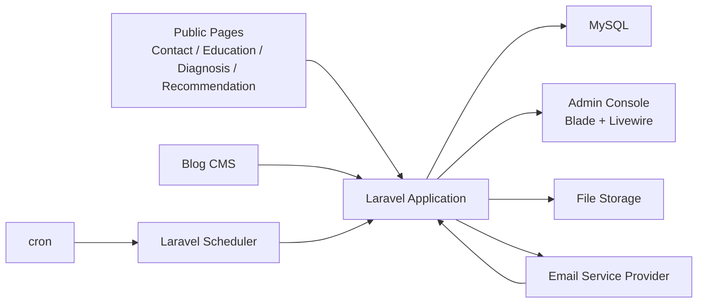

# PHP + MySQL Detailed Architecture

## 1. 설계 목표

이 문서는 `MAX Engage Hub` MVP를 `PHP + MySQL` 기반으로 구현하기 위한 상세 아키텍처 설계 문서다.

핵심 목표는 아래 3가지다.

- 작은 팀이 빠르게 개발하고 운영할 수 있는 구조
- 고객 데이터와 운영 이력이 하나의 흐름으로 연결되는 구조
- 복잡한 분산 시스템 없이도 이후 확장이 가능한 구조

## 2. 최종 기술 선택

MVP 기준 기술 조합은 아래로 고정한다.

- 언어: `PHP`
- 프레임워크: `Laravel`
- DB: `MySQL`
- 웹 서버: `Nginx`
- PHP 실행: `PHP-FPM`
- 관리자 UI: `Blade + Livewire`
- 파일 저장: 로컬 스토리지 또는 S3 호환 스토리지
- 스케줄러: `Laravel Scheduler + cron`
- 비동기 처리: `Laravel Queue`
- 메일 발송: 외부 Email Service Provider API

이 조합을 선택하는 이유는 다음과 같다.

- CRUD 중심 MVP를 빠르게 개발할 수 있다.
- 관리자 화면을 프론트엔드 분리 없이 빠르게 구현할 수 있다.
- 폼 수집, 운영 화면, webhook, 배치 작업을 하나의 앱에서 다룰 수 있다.
- 팀 규모가 작아도 유지보수 비용이 낮다.

## 3. 시스템 컨텍스트



## 4. 배포 토폴로지

MVP는 단일 서버 또는 소형 클라우드 인스턴스를 기준으로 설계한다.

### 권장 구성

- `Nginx`
- `PHP-FPM`
- `Laravel App`
- `MySQL`
- `Supervisor`
- `cron`

### 프로세스 역할

- `Nginx`: HTTP 요청 처리, 정적 파일 서빙, PHP-FPM 연동
- `PHP-FPM`: Laravel 애플리케이션 실행
- `MySQL`: 운영 데이터 저장
- `Supervisor`: Queue Worker 프로세스 관리
- `cron`: `php artisan schedule:run` 주기 실행

### 운영 환경 분리

- Local: 개발 환경
- Staging: 기능 검증 및 운영 시나리오 테스트
- Production: 실제 운영

## 5. 애플리케이션 내부 구조

Laravel 애플리케이션은 기능 단위로 나누되, 배포 단위는 하나로 유지한다.

### 계층 구조

#### Presentation Layer

- Public Form Controller
- Admin Controller / Livewire Component
- Webhook Controller

역할:

- 입력 수집
- 인증 확인
- 요청 검증
- 응답 반환

#### Application Layer

- Use Case Service
- Action Class
- Query Service

역할:

- 업무 흐름 조합
- 트랜잭션 경계 제어
- 외부 연동 호출

#### Domain Layer

- Eloquent Model
- Enum
- Policy
- Domain Rule Helper

역할:

- 상태값 규칙
- 추천 규칙
- 사례 전환 규칙
- 운영 제약 처리

#### Infrastructure Layer

- Repository 성격의 Query Class
- Mail Provider Client
- File Storage Adapter
- Queue Job
- Console Command

역할:

- DB 접근 최적화
- 외부 API 호출
- 파일 저장
- 비동기 작업 실행

## 6. 권장 디렉토리 구조

```text
app/
  Actions/
    Lead/
    Diagnosis/
    Education/
    Project/
    CaseLibrary/
    Mailing/
  Http/
    Controllers/
      Public/
      Admin/
      Webhooks/
    Requests/
  Livewire/
    Admin/
  Models/
  Services/
  Policies/
  Enums/
  Jobs/
  Console/
  Support/
database/
  migrations/
  seeders/
resources/
  views/
    admin/
    public/
routes/
  web.php
  api.php
```

## 7. 핵심 모듈 설계

| 모듈 | 주요 책임 | 핵심 테이블 | 주요 화면/기능 |
| --- | --- | --- | --- |
| Lead Intake | 폼 수집, 중복 확인, 고객 생성/병합 | `customers`, `lead_activities` | 문의 인박스, 고객 목록, 고객 상세 |
| CRM Lite | 상태, 메모, 후속 액션 관리 | `customers`, `customer_notes`, `follow_up_tasks` | 고객 상세, 후속 작업 관리 |
| Diagnosis | 진단 결과 저장, 수준 분류 | `diagnosis_results` | 진단 결과 카드, 요약 |
| Recommendation | 규칙 기반 추천 생성 | `recommendation_results`, `customer_tags` | 추천 결과, 태그 |
| Education Ops | 교육 프로그램, 회차, 참여자, 결과물 관리 | `education_programs`, `education_runs`, `education_participants`, `education_artifacts` | 교육 운영 보드 |
| Project Tracking | 후속 컨설팅/구축 프로젝트 관리 | `delivery_projects`, `project_artifacts`, `project_notes` | 프로젝트 보드 |
| Case Library | 사례 후보 등록, 승인, 검색 | `case_candidates`, `case_library` | 사례 검색, 사례 승인 |
| Blog Mailing | 블로그 발행 기반 메일링 | `blog_posts`, `email_campaigns`, `email_events` | 메일 발송, 반응 추적 |
| Dashboard | KPI 집계 및 시각화 | 집계 쿼리 또는 요약 테이블 | 운영 대시보드 |

## 8. 모듈별 세부 설계

### 8.1 Lead Intake

주요 책임:

- 퍼블릭 폼 입력 수집
- 이메일 기준 중복 고객 확인
- 신규 고객 생성 또는 기존 고객 활동 이력 추가
- 최초 상태값 부여

주요 처리 흐름:

1. `FormRequest`에서 입력 검증
2. 이메일 정규화
3. 고객 조회
4. 고객 생성 또는 갱신
5. `lead_activities` 저장
6. 운영 인박스에 표시할 상태 반영

구현 포인트:

- 이메일은 소문자 정규화 후 저장
- 유입 채널은 enum 또는 고정 코드로 관리
- 고객 생성과 활동 저장은 같은 트랜잭션에서 처리

### 8.2 CRM Lite

주요 책임:

- 고객 상태값 관리
- 운영 메모 저장
- 후속 액션 일정 저장

권장 추가 테이블:

- `customer_notes`
- `follow_up_tasks`

구현 포인트:

- `customers.status`는 영업 진행 상태
- `follow_up_tasks.status`는 액션 수행 상태
- 상태 변경 이력은 `lead_activities`에도 함께 남긴다

### 8.3 Diagnosis And Recommendation

주요 책임:

- 진단 응답 결과 저장
- maturity level 계산
- 규칙 기반 추천 생성
- 상담용 요약 노출

권장 구현 방식:

- 점수 계산은 Service Class에서 수행
- 추천 규칙은 코드 기반 규칙셋으로 시작
- 추천 결과는 계산만 하지 말고 DB에 스냅샷으로 저장

이유:

- 추후 규칙이 바뀌어도 당시 추천 근거를 유지할 수 있다.

### 8.4 Education Operations

주요 책임:

- 교육 프로그램 관리
- 회차 일정 관리
- 참여자 관리
- 결과물과 후속 액션 관리

구현 포인트:

- `education_runs`는 회사 단위 교육 실행 건을 의미한다.
- `education_artifacts`는 파일 자체보다 메타데이터와 연결성을 우선 저장한다.
- 파일은 Storage에 저장하고, DB에는 경로와 설명만 저장한다.

### 8.5 Project Delivery Tracking

주요 책임:

- 교육 이후 후속 프로젝트 생성
- 진행 메모 및 중간 산출물 누적
- 종료 요약 및 성과 기록

권장 추가 테이블:

- `project_notes`
- `project_artifacts`

구현 포인트:

- 프로젝트 상태값은 `planned`, `active`, `paused`, `completed`, `closed` 정도로 제한한다.
- 종료 요약은 자유 텍스트와 구조화된 성과 필드를 함께 가진다.

### 8.6 Case Capture And Reuse

주요 책임:

- 교육 결과물 또는 프로젝트 결과를 사례 후보로 승격
- 공개 가능 범위 검토
- 승인 후 사례 라이브러리 저장

구현 포인트:

- `case_candidates`에서 검토 상태를 분리한다.
- 승인 시 `case_library`에 복제 또는 전환 저장한다.
- 검색은 산업, 부서, 문제, 솔루션 유형 우선으로 설계한다.

### 8.7 Blog Mailing

주요 책임:

- 블로그 글 등록 또는 연동
- 세그먼트 발송 대상 생성
- 메일 발송 요청
- 이벤트 webhook 반영

구현 포인트:

- 수신 대상 확정 시점의 룰을 `email_campaigns.audience_rule`에 저장한다.
- 발송 결과와 이벤트는 분리 저장한다.
- 수신거부 발생 시 `customers.consent_marketing`를 즉시 갱신한다.

### 8.8 Dashboard

주요 책임:

- 운영 핵심 지표 집계
- 채널, 상태, 교육, 프로젝트, 메일링 성과 표시

MVP 구현 방식:

- 우선은 실시간 조회 쿼리로 시작
- 데이터가 늘어나면 일별 집계 테이블 추가

## 9. MySQL 데이터 설계 원칙

### 기본 원칙

- 스토리지 엔진은 `InnoDB`
- 문자셋은 `utf8mb4`
- 시간 저장은 UTC 기준
- 표시 시간대는 관리자 화면에서 변환
- 모든 PK는 `bigint unsigned` 또는 Laravel 기본 ID 사용
- FK는 가능한 한 명시적으로 둔다

### 컬럼 설계 원칙

- 상태값은 문자열 enum 스타일 코드 사용
- 유연성이 필요한 부가 데이터만 JSON 컬럼 사용
- 검색/필터에 쓰는 값은 JSON에 숨기지 않는다

### 인덱스 원칙

- 고객 조회: `email`, `status`, `company_name`
- 활동 이력: `(customer_id, created_at)`
- 교육 참여 조회: `(education_run_id, customer_id)`
- 프로젝트 조회: `(customer_id, status)`
- 사례 검색: `industry`, `department`, `solution_type`
- 메일 이벤트 조회: `(campaign_id, customer_id, event_type)`

### 트랜잭션 원칙

아래는 반드시 하나의 트랜잭션으로 묶는다.

- 고객 생성 + 활동 생성
- 진단 결과 저장 + 추천 결과 저장
- 사례 후보 승인 + 사례 라이브러리 반영
- 메일 수신거부 이벤트 반영 + 고객 동의 상태 갱신

## 10. 권장 테이블 구조 보강

기존 핵심 테이블 외에 아래 보조 테이블을 추가하는 것이 좋다.

### `users`

- 관리자 계정
- 최소 역할: `admin`, `operator`, `sales`, `instructor`

### `customer_notes`

- 고객 메모
- 작성자와 작성 시점 저장

### `follow_up_tasks`

- 후속 액션 일정
- 담당자, 예정일, 완료 상태 저장

### `project_notes`

- 프로젝트 진행 메모

### `project_artifacts`

- 프로젝트 중간 산출물 메타데이터

### `integration_logs`

- 메일 발송 API 호출 결과
- webhook 수신 로그
- 재처리 추적

## 11. 주요 MySQL 테이블 인덱스 예시

### `customers`

- unique index: `email`
- index: `(status, updated_at)`
- index: `company_name`

### `lead_activities`

- index: `(customer_id, created_at)`
- index: `(activity_type, created_at)`
- index: `source`

### `diagnosis_results`

- index: `(customer_id, created_at)`
- index: `maturity_level`

### `education_runs`

- index: `(status, start_date)`
- index: `company_name`

### `delivery_projects`

- index: `(customer_id, status)`
- index: `(project_type, status)`

### `case_library`

- index: `industry`
- index: `department`
- index: `solution_type`

### `email_events`

- index: `(campaign_id, event_type, occurred_at)`
- index: `(customer_id, occurred_at)`

## 12. API 설계 방향

MVP는 API first보다 운영 중심을 우선한다.

즉, Laravel 웹 앱 내부 라우트와 관리자 화면을 중심으로 만들고, 외부 공개가 필요한 입력만 안정적으로 받는다.

### Public Endpoints

- `POST /inquiries/contact`
- `POST /inquiries/education`
- `POST /diagnosis/submit`
- `POST /recommendations/request`

### Admin Web Routes

- `GET /admin/inbox`
- `GET /admin/customers`
- `GET /admin/customers/{id}`
- `POST /admin/customers/{id}/notes`
- `POST /admin/customers/{id}/tasks`
- `GET /admin/education/runs`
- `GET /admin/projects`
- `GET /admin/cases`
- `GET /admin/mailing/campaigns`
- `GET /admin/dashboard`

### Webhook Routes

- `POST /webhooks/email/provider`
- `POST /webhooks/blog/provider`

## 13. 비동기 처리 설계

MVP에서도 아래 작업은 동기 처리보다 Queue가 낫다.

- 메일 발송 요청
- 메일 이벤트 재처리
- 일별 지표 집계
- 대량 세그먼트 대상 계산

### 권장 방식

- 초기에는 `database` queue driver 사용
- Worker는 `Supervisor`로 관리
- 실패 Job은 재시도 가능하게 구성

이 방식은 Redis 같은 추가 인프라 없이도 운영 가능하다.

## 14. 파일 저장 설계

업로드 파일은 DB에 직접 저장하지 않는다.

권장 방식:

- 파일 본문은 Storage에 저장
- DB에는 아래 정보만 저장
  - 파일 경로
  - 파일명
  - MIME 타입
  - 파일 크기
  - 연결된 도메인 객체 ID

초기 운영은 로컬 스토리지로 가능하지만, 운영 환경에서는 S3 호환 스토리지가 더 안전하다.

## 15. 보안 설계

### 관리자 인증

- Laravel 세션 기반 인증
- 비밀번호 해시 저장
- 로그인 시도 제한

### 퍼블릭 폼 보안

- 입력 검증
- CSRF 또는 토큰 기반 보호
- Rate Limiting
- 스팸 방지용 hidden field 또는 captcha 옵션

### 외부 연동 보안

- webhook signature 검증
- API Key는 `.env`로 관리
- 관리자 권한 없는 사용자는 내부 화면 접근 불가

### 개인정보 보호

- 로그에 민감 정보 전체를 남기지 않는다
- 파일 URL은 직접 공개 대신 서명 URL 또는 관리자 인증 뒤 제공

## 16. 관측성과 운영 로그

최소 운영 로그 범위는 아래와 같다.

- 폼 제출 성공/실패
- 고객 생성/병합 결과
- 메일 발송 요청 성공/실패
- webhook 수신 및 처리 결과
- Queue 실패 Job
- 스케줄러 실행 결과

권장 도구:

- Laravel 로그
- 예외 추적 도구 1종
- DB 백업 상태 모니터링

## 17. 성능 및 확장 전략

MVP 단계에서는 과도한 분산 구조를 도입하지 않는다.

확장 순서는 아래가 적절하다.

1. 쿼리 인덱스 최적화
2. 관리자 목록 페이지네이션
3. 파일 스토리지 외부화
4. Queue Worker 분리
5. 읽기 집계 테이블 도입

처음부터 하지 않는 것:

- 마이크로서비스
- Kafka 같은 메시지 브로커
- 복잡한 이벤트 소싱
- 별도 검색 엔진

## 18. 구현 우선순위

### 1차 구현

- 인증
- 고객/활동 저장
- 관리자 인박스
- 고객 상세

### 2차 구현

- 진단/추천
- 태그
- 사례 검색

### 3차 구현

- 교육 운영
- 교육 결과물
- 후속 액션

### 4차 구현

- 프로젝트 관리
- 사례 후보 전환

### 5차 구현

- 블로그 메일링
- webhook
- 대시보드

## 19. 최종 권장안

이 프로젝트의 MVP는 `Laravel 기반 모놀리식 운영 시스템`으로 가는 것이 가장 적절하다.

정리하면 아래 구조가 최적이다.

- 퍼블릭 폼과 관리자 화면을 하나의 Laravel 앱에서 처리
- MySQL 하나에 고객, 교육, 프로젝트, 사례, 메일 데이터를 통합 저장
- Blade + Livewire로 내부 운영 UI를 빠르게 구축
- Scheduler와 Queue로 메일링, 집계, 재처리만 최소 비동기화
- 파일 저장과 메일 발송만 외부 인프라를 사용

이 구조는 현재 요구 범위에 비해 충분히 단순하면서도, 이후 기능 확장에 필요한 여지는 남긴다.

공유호스팅 제약이 있는 배포 환경을 써야 한다면 [09-dothome-free-hosting-profile.md](/Users/magic/work/MAX-Engage-Hub/docs/09-dothome-free-hosting-profile.md)의 축소 프로파일을 따른다.
