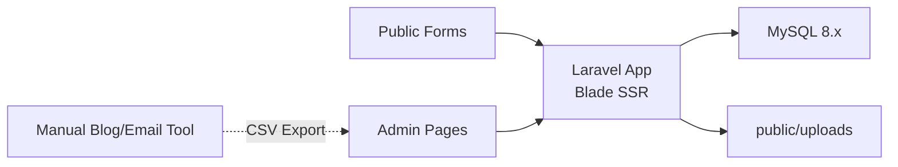

# Dothome Free Hosting Deployment Profile

## 1. 목적

이 문서는 `MAX Engage Hub`를 `닷홈 무료호스팅` 환경에 맞춰 배포하고 운영하기 위한 축소 배포 프로파일이다.

기본 상세 아키텍처는 [08-php-mysql-detailed-architecture.md](/Users/magic/work/MAX-Engage-Hub/docs/08-php-mysql-detailed-architecture.md)를 따르되, 무료호스팅 제약 때문에 아래 항목은 단순화하거나 수동 운영으로 대체한다.

## 2. 공식 제공 환경 정리

2026년 3월 19일 기준으로 닷홈 공식 문서에서 확인되는 무료호스팅 정보는 아래와 같다.

- 무료호스팅 기본 사양: 디스크 `500MB`, 트래픽 `월 15GB`, DB `MySQL 8.x`, PHP `7.4 / 8.0 / 8.2 / 8.4` 선택 가능
- 무료호스팅은 `폼메일 지원 X`
- 2025년 7월 17일 이후 신청한 신규 무료호스팅은 기본 도메인에 SSL 적용
- 2026년 3월 3일부터 신규 웹호스팅 상품군의 무료호스팅 계정 중 지원 대상은 SSH와 Git 명령어 지원

중요한 점:

- 무료호스팅 상품 페이지에는 무료호스팅 SSH 지원으로 보이는 표기가 있으나, 공지사항은 `2026년 3월 3일`, `신규 웹호스팅 상품군`, `지원 대상 IP` 조건을 명시한다.
- 따라서 계정마다 실제 SSH 사용 가능 여부가 다를 수 있다.
- 배포 전 반드시 `마이닷홈 > 호스팅 관리 > 상세보기`에서 본인 계정의 SSH 활성화 가능 여부를 확인해야 한다.

## 3. 결론

닷홈 무료호스팅에서도 Laravel 운영은 가능하다.

다만 아래 조건이 붙는다.

- 개발 환경은 로컬에서 구축한다.
- 서버에서는 가능하면 단순 실행만 한다.
- `Queue Worker`, `Supervisor`, `cron 기반 스케줄링`, `대용량 파일 운영`, `자동 메일링` 같은 기능은 기본 아키텍처에서 제외하거나 수동화한다.

즉, 이 배포 프로파일은 `운영 CRM Lite + 리드 수집 + 교육/프로젝트 기록 + 사례 축적` 중심으로 맞춘다.

## 4. 무료호스팅용 최종 권장 구조



핵심 차이:

- 관리자 화면은 `Blade` 중심으로 단순화한다.
- 비동기 처리와 스케줄러 의존성을 제거한다.
- 메일링은 앱 내부 자동 발송보다 `수동 대상 추출` 중심으로 바꾼다.
- 파일 저장은 `public/uploads` 방식으로 단순화한다.

## 5. 유지하는 기능

무료호스팅에서도 유지 가능한 MVP 기능은 아래다.

- 문의/교육/진단/추천 폼 수집
- 이메일 기준 고객 중복 처리
- 고객 목록 및 고객 상세
- 활동 이력 타임라인
- 고객 메모 및 후속 액션
- 진단 결과 및 추천 결과 저장
- 교육 프로그램/회차/참여자/결과물 관리
- 프로젝트 생성 및 진행 메모
- 사례 후보 및 사례 라이브러리
- 기본 대시보드 조회

## 6. 축소 또는 변경하는 기능

### A. 메일링

기본 아키텍처:

- 블로그 글 선택
- 앱에서 메일 발송
- webhook으로 오픈/클릭 수집

무료호스팅 프로파일:

- 앱에서는 발송 대상 고객을 필터링하고 CSV로 내보낸다.
- 실제 발송은 외부 메일 서비스 대시보드에서 수동 발송한다.
- 오픈/클릭 webhook 수집은 1차 MVP에서 제외한다.

이유:

- 무료호스팅은 공식적으로 `폼메일 지원 X`다.
- 서버 발송과 메일 이벤트 자동화를 무료호스팅 전제로 설계하면 운영 안정성이 떨어진다.

### B. 스케줄러 / 배치

기본 아키텍처:

- `Laravel Scheduler + cron`
- 일별 집계 또는 메일링 배치

무료호스팅 프로파일:

- 스케줄러 기반 자동 작업을 쓰지 않는다.
- 보고서 집계는 관리자 화면에서 조회 시점에 계산한다.
- 필요하면 관리자 전용 `수동 집계 실행` 버튼으로 대체한다.

### C. Queue

기본 아키텍처:

- `Laravel Queue`

무료호스팅 프로파일:

- 기본값은 `sync` 드라이버
- 요청 시간이 길어질 수 있는 작업은 화면에서 수동 단계로 분리

### D. 파일 저장

기본 아키텍처:

- Storage 디스크 + 외부 스토리지 가능

무료호스팅 프로파일:

- `public/uploads` 직접 저장
- 파일 크기 제한을 두고 대용량 자료는 외부 링크로 대체

### E. 실시간/고급 통계

기본 아키텍처:

- 집계 쿼리 또는 요약 테이블

무료호스팅 프로파일:

- 간단한 리스트/카운트 쿼리만 사용
- 무거운 분석성 쿼리는 제외

## 7. 무료호스팅용 기술 결정

### 서버 사이드

- `PHP 8.2`
- `Laravel`
- `MySQL 8.x`
- `Apache + .htaccess`

### UI

- `Blade`
- 최소한의 `Alpine.js`

`Livewire`는 가능할 수 있지만, 1차 배포는 Blade 중심으로 가는 편이 안전하다.

## 8. Laravel 앱 구조 조정

무료호스팅 배포에서는 아래 원칙을 따른다.

### 유지

- 단일 Laravel 앱
- 기능 단위 Controller / Service / Model 구조
- FormRequest 검증
- Eloquent 기반 CRUD

### 조정

- 외부 워커 의존 코드 제거
- Job dispatch 최소화
- WebSocket, Redis, 실시간 이벤트 미사용
- 복잡한 프론트엔드 빌드 체인 최소화

## 9. 설정 원칙

`.env` 권장값 예시:

```env
APP_ENV=production
APP_DEBUG=false
APP_URL=https://your-id.dothome.co.kr

LOG_CHANNEL=single
LOG_LEVEL=warning

CACHE_STORE=file
SESSION_DRIVER=file
QUEUE_CONNECTION=sync

DB_CONNECTION=mysql
```

설정 의도:

- 캐시/세션은 파일 기반
- 큐는 동기 실행
- 로그는 작게 유지

## 10. 배포 방식

닷홈 무료호스팅에서는 `서버에서 빌드`보다 `로컬에서 빌드 후 업로드`가 기본 전략이다.

### 권장 배포 방식 A. SSH 사용 가능

조건:

- 2026년 3월 3일 이후 적용 대상 무료호스팅 계정
- 지원 대상 IP
- SSH 접속설정 활성화 가능

절차:

1. 로컬에서 코드 개발
2. 로컬에서 `composer install --no-dev` 실행
3. 로컬에서 캐시/최적화 준비
4. Git 또는 SFTP/SSH로 업로드
5. 서버에서 `.env` 설정
6. SSH로 필요한 최소 artisan 명령 실행

### 권장 배포 방식 B. SSH 미지원

절차:

1. 로컬에서 `vendor` 포함 배포본 생성
2. FTP로 업로드
3. DB는 phpMyAdmin 또는 앱 초기 설치 라우트로 반영
4. 운영 중 설정 변경은 `.env` 직접 수정

이 경우 서버에서 `composer`, `artisan`, `npm` 실행을 전제하지 않는다.

## 11. 디렉토리 배치 원칙

닷홈 예시 문서에서 CMS 설정 파일 경로가 `html/wp-config.php`처럼 안내되는 점을 보면, 웹루트가 `html/` 구조인 환경일 가능성이 높다.

이 문장은 공식 경로 예시를 바탕으로 한 추론이다.

권장 배치:

- 웹루트: `html/`
- Laravel 앱 본체: 웹루트 바깥 또는 상위 홈 디렉토리
- 웹 노출 파일: `public/index.php`, `public/assets`, `public/uploads`

만약 웹루트 밖 배치가 불가능하면 아래 대안을 쓴다.

- Laravel 전체를 `html/` 아래에 올리되
- 민감 파일 접근을 `.htaccess`로 차단
- `.env`, `storage`, `vendor` 직접 접근 차단 규칙 추가

이 방식은 차선책이다.

## 12. storage:link 대체 원칙

무료호스팅에서는 심볼릭 링크가 불확실하므로 `php artisan storage:link`를 전제로 설계하지 않는다.

대신 아래처럼 처리한다.

- 업로드 파일은 `public/uploads/...`에 저장
- DB에는 상대 경로 저장
- 다운로드/조회는 인증 체크 후 직접 응답하거나 공개 파일만 직접 링크

## 13. Phase별 구현 조정

### Phase 0. Foundation Setup

추가 작업:

- 닷홈용 배포 템플릿 정리
- `.htaccess` 정책 정의
- 파일 업로드 경로를 `public/uploads`로 고정
- `QUEUE_CONNECTION=sync` 기준으로 코드 작성

### Phase 1. Lead Intake Foundation

그대로 진행 가능하다.

우선 구현 대상:

- 문의 API
- 고객/활동 저장
- 관리자 인박스
- 고객 상세

### Phase 2. Diagnosis And Consultation Support

그대로 진행 가능하다.

우선 구현 대상:

- 진단 결과
- 추천 결과
- 태그
- 사례 검색

### Phase 3. Education Operations

그대로 진행 가능하지만 결과물 파일은 크기 제한이 필요하다.

운영 규칙:

- 큰 파일은 구글 드라이브 등 외부 링크 사용
- 앱에는 메타데이터와 링크만 저장 가능

### Phase 4. Project Delivery Tracking

그대로 진행 가능하다.

### Phase 5. Case Capture And Reuse

그대로 진행 가능하다.

### Phase 6. Blog Mailing Loop

자동 발송형 구현 대신 아래로 축소한다.

- 블로그 글 등록
- 발송 대상 필터링
- 고객 CSV 내보내기
- 수동 발송 이력 기록

즉, `메일링 운영 지원`까지만 하고 `자동 발송 + webhook 반응 수집`은 제외한다.

### Phase 7. Performance Dashboard

자동 집계형 구현 대신 아래로 축소한다.

- 단순 카운트 대시보드
- 최근 30일 기준 조회형 리포트
- 메일링 성과는 수동 입력 또는 외부 리포트 참조

## 14. 운영상 제한

### 용량

- 500MB 안에서 코드, 업로드, 로그를 모두 관리해야 한다.
- `vendor` 포함 Laravel 배포는 용량을 빠르게 소모할 수 있다.

### 트래픽

- 월 15GB 제한이므로 이미지와 파일 다운로드를 최소화해야 한다.

### 메일

- 앱에서 직접 메일 발송하는 구조는 기본 설계에서 제외한다.

### SSH

- 계정 조건에 따라 가능 여부가 달라진다.

## 15. 무료호스팅용 최종 권장 MVP

닷홈 무료호스팅에 가장 잘 맞는 MVP 범위는 아래다.

- 리드 수집
- 고객/상담 관리
- 진단 결과 저장
- 교육 운영 기록
- 프로젝트 기록
- 사례 축적
- 수동 메일링 대상 추출
- 단순 관리자 대시보드

반대로 아래는 2차 과제로 미룬다.

- 자동 메일 발송
- 메일 webhook 수집
- cron 기반 스케줄링
- queue worker 기반 비동기 처리
- 대용량 파일 자산 운영

## 16. 배포 전 체크리스트

1. 내 무료호스팅 계정이 SSH 지원 대상인지 확인
2. 기본 도메인에 HTTPS가 적용되는 신규 계정인지 확인
3. PHP 버전을 `8.2`로 설정
4. DB 접속 정보와 phpMyAdmin 접근 확인
5. 웹루트 구조가 `html/`인지 확인
6. `.htaccess` 동작 여부 확인
7. 파일 업로드 용량 제한 확인
8. 초기 배포 용량이 500MB 내인지 확인

## 17. 최종 판단

닷홈 무료호스팅에서는 `Laravel 전체 기능`이 아니라 `Laravel 기반 경량 운영 시스템`으로 설계해야 한다.

가장 현실적인 전략은 아래다.

- 로컬에서 개발
- 무료호스팅에는 경량화된 Blade 기반 앱 배포
- 배치와 메일링 자동화는 제거
- 운영 데이터 축적과 관리자 조회에 집중

이 프로파일을 따르면 무료호스팅 환경에서도 초기 MVP 검증은 가능하다.
